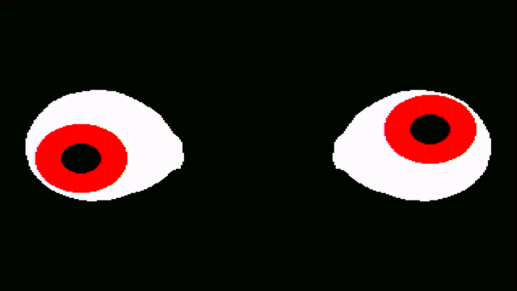

# PicoVision Eyes

Animated eyes for the [Pimoroni PicoVision](https://shop.pimoroni.com/products/picovision)

Based _**very**_ loosely on [Adafruit / Phillip Burgess (Paint Your Dragon)'s Animated Snake Eyes for Raspberry Pi](https://learn.adafruit.com/animated-snake-eyes-bonnet-for-raspberry-pi/software-installation)

### Known Limitations

The animation is _**slow**_... It hasn't been optimised... Each frame:
* Erases the previous eyes with white rectangles
* Draws the irises and dilated pupils as circles at the desired locations
* Interpolates the position of the upper and lower eyelids, based on the blink fraction between the fully-open and fully-closed paths
* Draws the four eyelids as polygons

To keep the frame rate reasonable, it uses 320x240 pixels and 5-bit color. Rendering two small eyes is faster than rendering one large eye,

### The Challenge

Can you optimise my terrible code and increase the frame rate? The ultimate goal would be to:
* Animate a single eye at >= 640x480 pixels at >= 10Hz
* Have two PicoVision boards: one for the left eye and a second for the right
* Link the two over WiFi and have them track motion using a separate movement / distance sensor

Imagine your house at Halloween: with TV-sized eyes in the upstairs windows, tracking trick-or-treaters as they walk past your house...

### Files

* [pv_eyes.py](./pv_eyes.py) is MicroPython, ready to be dropped onto the PicoVision using Thonny
* [utils](./utils/) contains code from the original snake eyes demo, which converts the eyelid SVG paths into coordinates

Enjoy!

Paul

